# H1-B Visa Data Analysis
#### ATCS Data Analysis Project by Alexandre H.

<!--
Notes: 
-->

---
transition: fade-out
---

# Where does this data come from & what does it contain?

### Where:
- 👀 Found the dataset on [Kaggle](https://www.kaggle.com/datasets/abrambeyer/h1b-visa-petitions-20152019/data)
- 🏛️ Original dataset from the [U.S. Department of Labor](https://www.dol.gov/agencies/eta/foreign-labor/performance)

<br />

### What:
- 📊 Contains information about H1-B Visa petitions from 2015 to 2019
- 📈 Includes information about the employer, the job, the location, and the employee
- 📜 Only includes data from certain states (Pennsylvania, Illionois, New York, Michigan, Ohio,
      'Minnesota, Indiana, Wisconsin)

---
transition: fade-out
---

# What is an H1-B Visa?

- Allows U.S. 🇺🇸 employers to employ foreign workers 🌎 in specialty occupations.

<br/>

- A specialty occupation 🛠️ requires the application of specialized knowledge 🧠 and a bachelor's degree or the equivalent of work experience.

<br/>

- The duration of stay is three years ⏳, extendable to six years.

<br/>

- The visa is dual-intent, meaning the visa holder can apply for a green card 🟢 / permanent resident card.

---
transition: fade-out
---

# Preparation - Loading the data

- Data had non UTF-8 characters, so I had to use the `encoding` parameter in the `read_csv` function to specify the correct encoding.

<br/>

```python
df = pd.read_csv("data/h1b_disclosure_data_2015_2019.csv")
```
would cause:
```python
UnicodeDecodeError: 'utf-8' codec can't decode byte 0xdc in position 119444: invalid continuation byte
```

so I used:
```python
df = pd.read_csv("data/h1b_disclosure_data_2015_2019.csv", encoding='latin1')
```
instead.

---
transition: fade-out
---

# Preparation - Cleaning the data (1/3)

- Removed any duplicate cases
```python
df['CASE_NUMBER'].duplicated().sum() # 17770 duplicates / 2% of the data
df = df.drop_duplicates()
```

- Removed any unnecessary columns
```python
# Remove unnecessary columns for analysis
df = df.drop('CASE_NUMBER', axis=1)

# Drop columns which I do not understand
df = df.drop('SOC_CODE', axis=1)

# Remove columns with repeated data (worksite is the same as city + state)
df = df.drop('WORKSITE', axis=1)
```

---
transition: fade-out
---

# Preparation - Cleaning the data (2/3)
- Removed any N/A Values
```python
for col in df.columns:
    column = df[col]
    print(column.isna().sum() / len(df) * 100)

# No columns have more than 10% of missing data, so drop rows with missing data
df = df.dropna()
```

- Removed any salaries that were less than or equal to 0
```python
df = df[df['PREVAILING_WAGE'] > 0]
```

---
transition: fade-out
---

# Preparation - Cleaning the data (3/3)
- Fixed any formatting errors
```python
# Replace "FULL_TIME_POSITION" (which currently has "Y" or "N") with True/False
df["FULL_TIME_POSITION"] = df["FULL_TIME_POSITION"].map(lambda x: x == "Y")

# Convert "PREVAILING_WAGE" into int
df["PREVAILING_WAGE"] = df["PREVAILING_WAGE"].map(lambda x: int(x))

# Remove commas at end of certain WORKCITY_CITY columns
df["WORKSITE_CITY"] = df["WORKSITE_CITY"].map(lambda x: str(x).removesuffix(","))

# Cleanup WORKSITE_STATE_ABB
worksite_abb_map = {"NEWYORK": "NY", "ILLINOIS": "IL", "PENNSYLVANIA": "PA", "MICHIGAN": "MI", "OHIO": "OH", "MINNESOTA": "MN", "INDIANA": "IN", "WISCONSIN": "WI"}
df["WORKSITE_STATE_ABB"] = df["WORKSITE_STATE_ABB"].map(lambda x: worksite_abb_map[x] if x in worksite_abb_map.keys() else x)

# Cleanup JOB_TITLE by removing &NBSP; and &AMP;
df["JOB_TITLE"] = df["JOB_TITLE"].map(lambda x: x.replace("&NBSP;", " ").replace("&AMP;", "&"))
```

---
transition: fade-out
---

# Preparation - Data Preview
<Transform :scale="0.75">

|        Column       |           Value           |                    Info                    |
|:--------------------|:--------------------------|:-------------------------------------------|
| CASE_STATUS         | CERTIFIED                 |            Certified = Approved            |
| EMPLOYER_NAME       | IT CATS LLC               |                                            |
| SOC_NAME            | COMPUTER SYSTEMS ANALYSTS | SOC = Standard Occupational Classification |
| JOB_TITLE           | SENIOR BUSINESS ANALYST   |                                            |
| FULL_TIME_POSITION  | True                      |                                            |
| PREVAILING_WAGE     | 109116                    |                   in USD                   |
| WORKSITE_CITY       | NORTH WALES               |                                            |
| WORKSITE_STATE_ABB  | PA                        |                                            |
| YEAR                | 2015                      |   Year submitted, not year of employment   |
| WORKSITE_STATE_FULL | PENNSYLVANIA              |                                            |

</Transform>

---
transition: fade-out
---

# Data Analysis - Univariate - H1-B Approval Rate


---
transition: fade-out
---

# Data Analysis - Univariate - Popular Job Titles

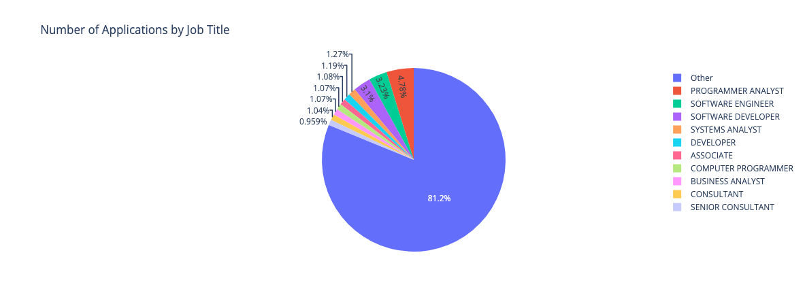

---
transition: fade-out
---

# Data Analysis - Univariate - Popular Employers

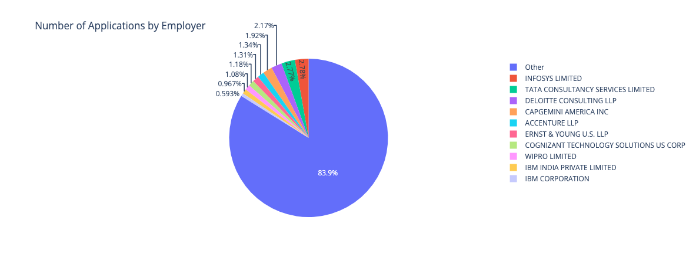

---
transition: fade-out
---

# Data Analysis - Univariate - Popular States

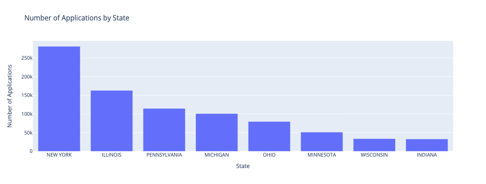

---
transition: fade-out
---

# Data Analysis - Univariate - Year Distribution

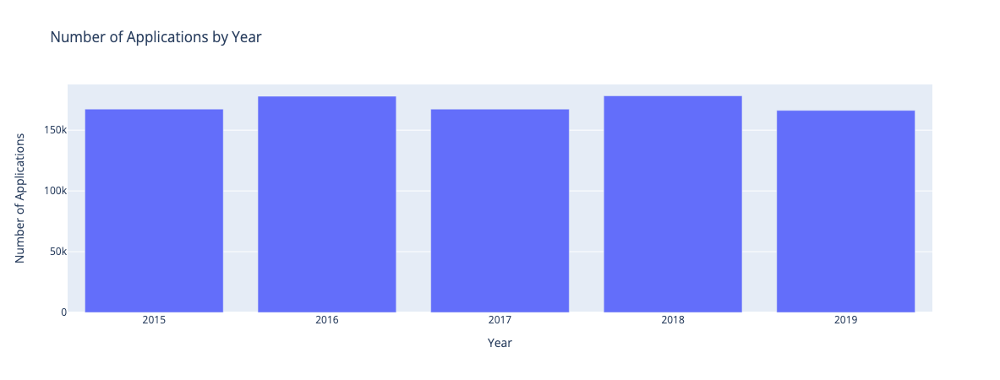

---
transition: fade-out
---

# Data Analysis - Univariate - Salary (full range)

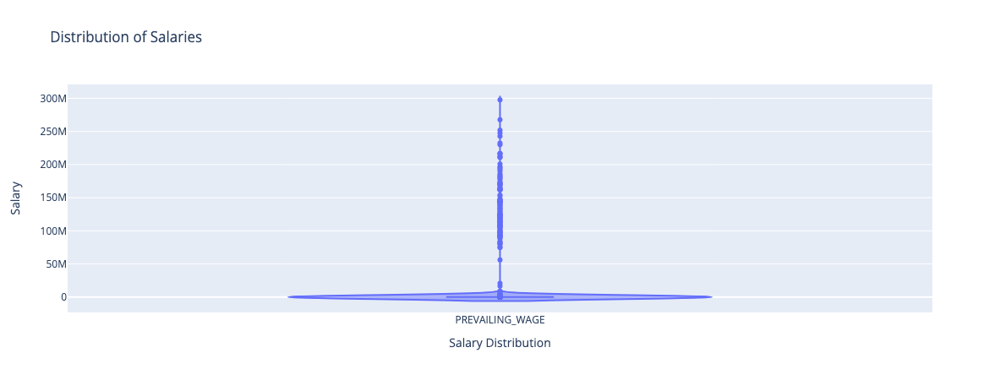

---
transition: fade-out
---

# Data Analysis - Univariate - Salary (all salaries under $250,000, >95% of data)

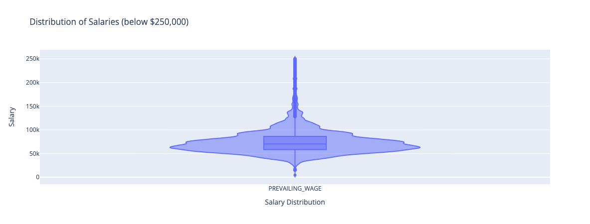

---
transition: fade-out
---

# Data Analysis - Bivariate - Top Paying Roles

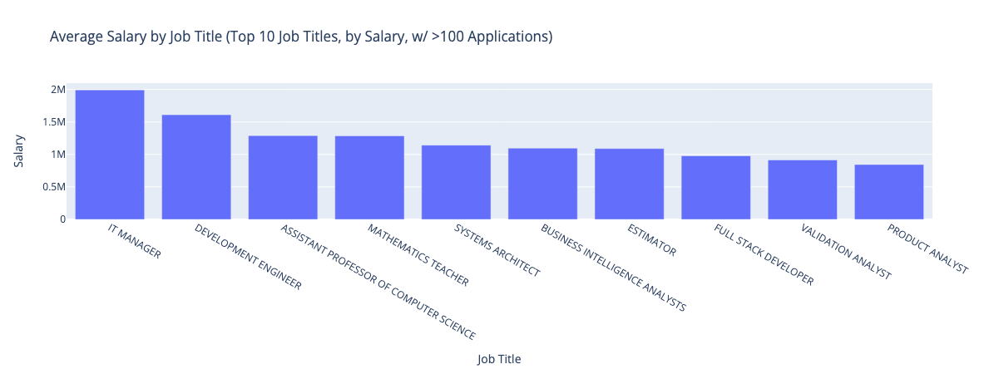

---
transition: fade-out
---

# Data Analysis - Bivariate - Top Paying Employers

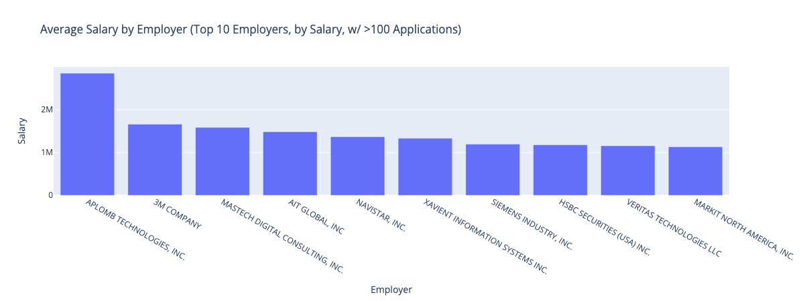

---
transition: fade-out
---

# Data Analysis - Bivariate - Top Paying States

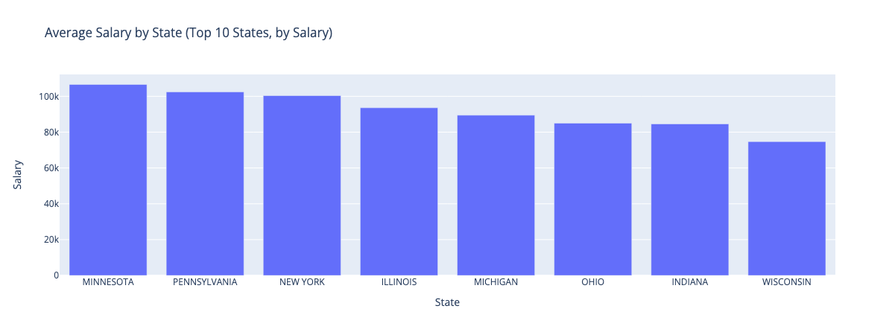

---
transition: fade-out
---

# Data Analysis - Bivariate - Salary by Year

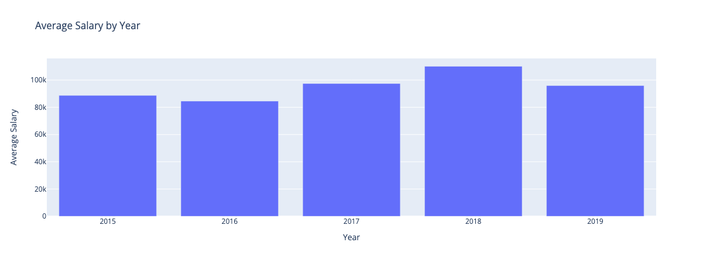

---
transition: fade-out
---

# Data Analysis - Bivariate - Most Accepted Job Titles

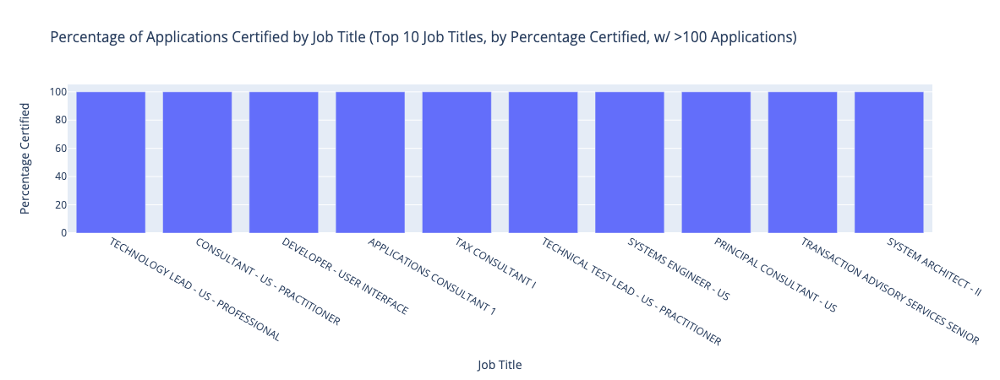

---
transition: fade-out
---

# Data Analysis - Bivariate - Least Accepted Job Titles

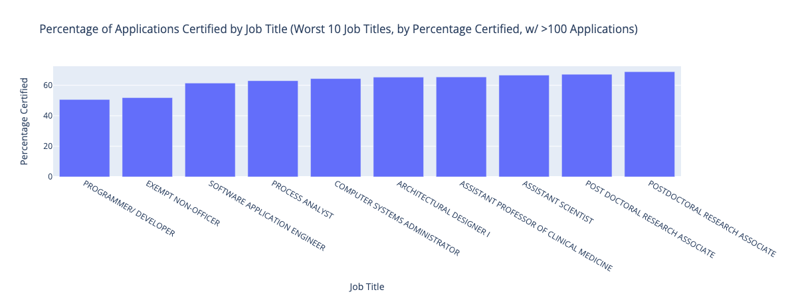

---
transition: fade-out
---

# Data Analysis - Bivariate - Most Accepted Employers

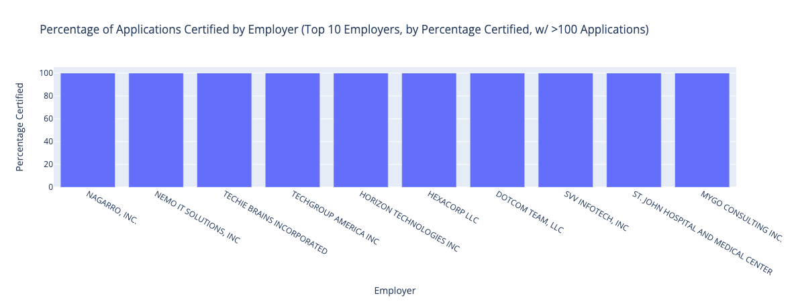

---
transition: fade-out
---

# Data Analysis - Bivariate - Least Accepted Employers

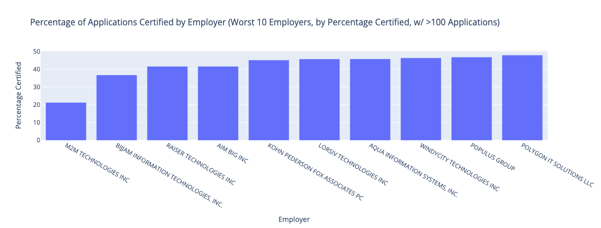

---
transition: fade-out
---

# Data Analysis - Bivariate - Full-Time vs Part-Time Acceptance Rate

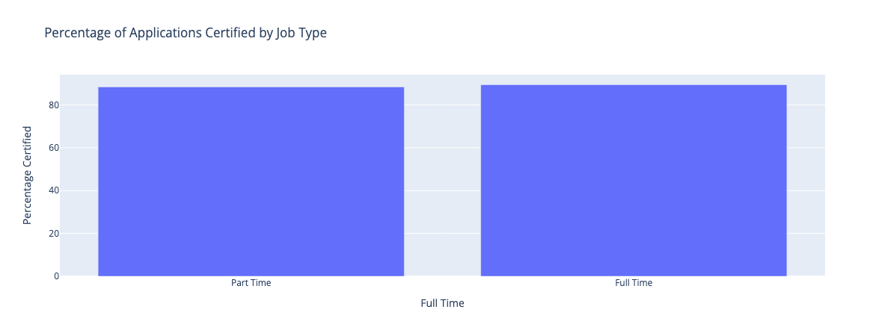

---
transition: fade-out
---

# Questions about the data

1. How has salary changed over time? Has it followed inflation?
- 📉 Salary dipped slightly from 2015-2016 (~$88k)
- 📈 Increased steadily from 2016-2018 (~$110k)
- 📉 Dipped back down in 2019 (~$95k, covid?)
- 📊 Beat inflation from 2015-2018, but not 2015-2019

<br/>

2. Does a part-time/full-time job affect the acceptance rate?
- 📊 Full-time jobs have a slightly higher acceptance rate (89.5% vs 88.5%)

<br/>

3. How does the mean salary vary by state?
- 📊 Significant variation from state to state
- 📉 Lowest pay state was Wisconsin (average $74k)
- 📈 Highest pay state was Minnesota (average $106k)

---
transition: fade-out
---

# Next Steps
1. Further Uses:
- Compare data to other countries -> Further insight into the global job market
- Compare data to other years (pre 2015 or post 2019) -> Further insight into the American job market over time

<br/>

2. Potential Models
- Predicting the acceptance rate of a job based on the employer, job title, and salary
- Predicting the salary of a job based on the employer and job title

<br/>

3. How is this beneficial?
- Can help employers/employees understand the likelihood of their job being accepted
- Can help employees better understand the average salary for their job


